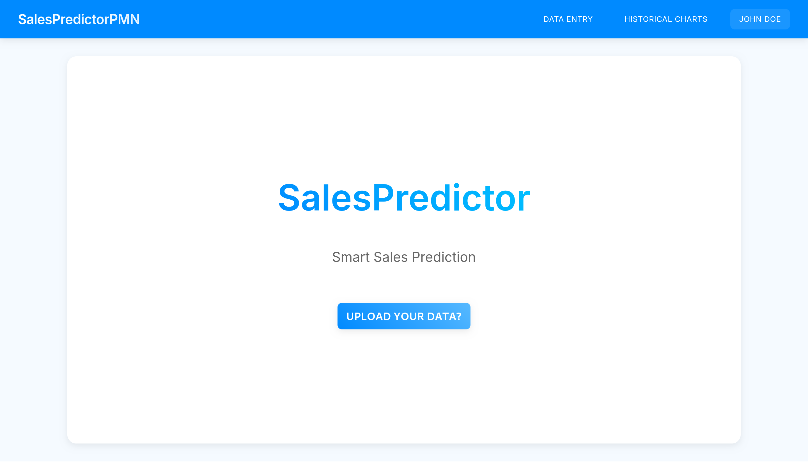
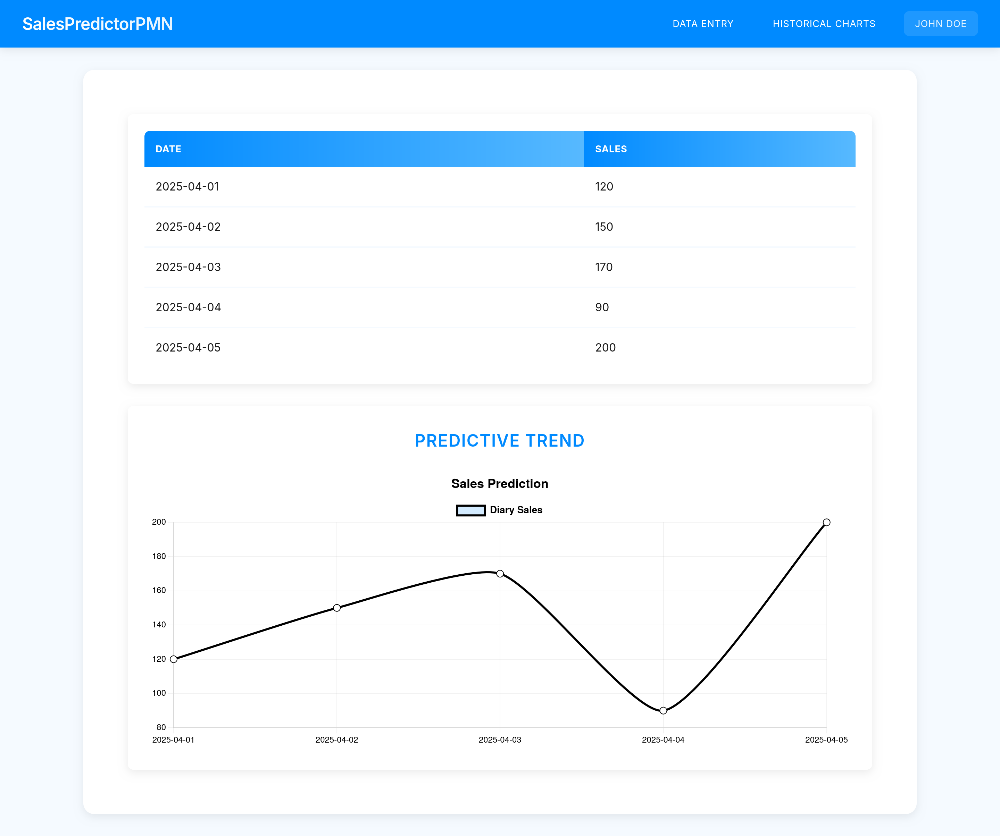
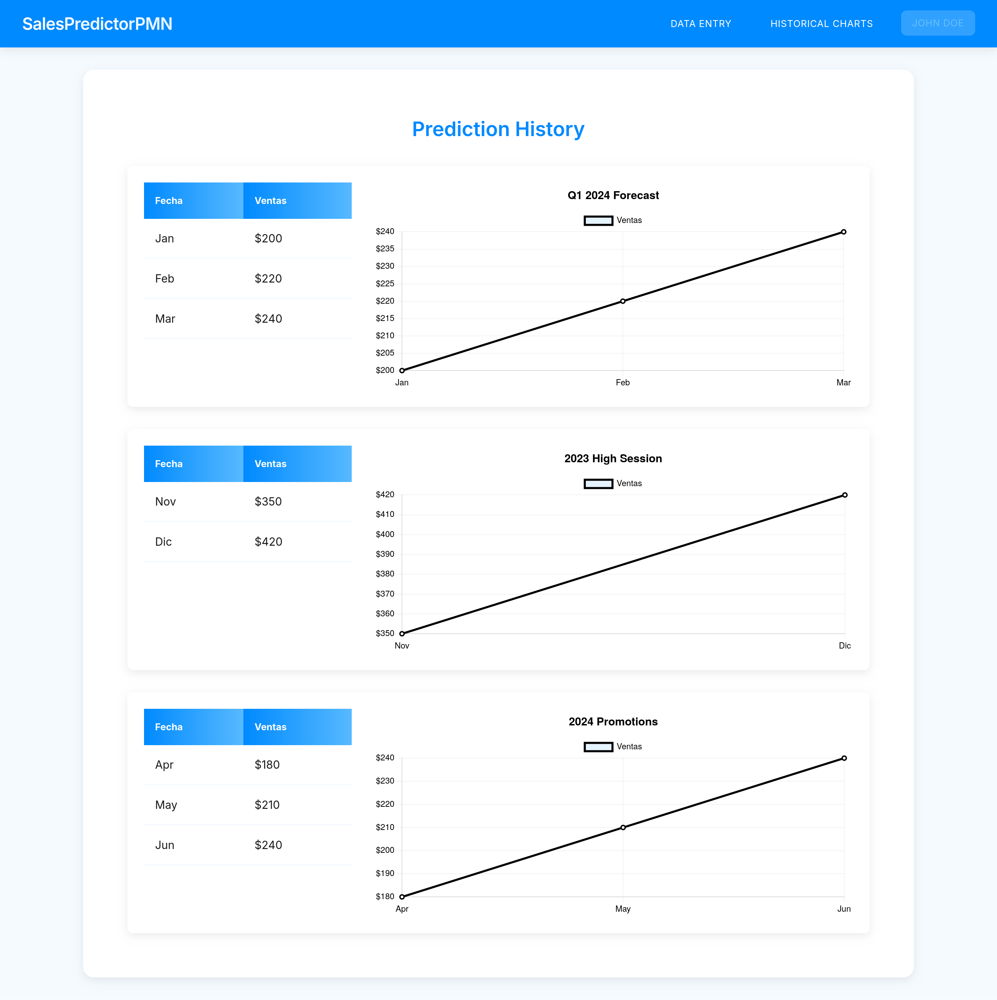

# SalesPredictor-PMN 🚀

**Predictor de Ventas - Maqueta Funcional (PMN)**
*Prototipo de demostración para análisis predictivo de ventas*

🔗 **[Ver despliegue en vivo aquí](https://sales-predictor-86tcd1ndb-sintaxis-projects.vercel.app/)**

---

## 📌 Descripción

SalesPredictor-PMN es una maqueta funcional (PMN) que simula un sistema completo de predicción de ventas, diseñado para demostrar capacidades técnicas y flujos de usuario. Es ideal para:

- Demostraciones técnicas de interfaces analíticas
- Pruebas de concepto de visualización de datos
- Proyectos educativos en desarrollo frontend
- Base para personalizaciones específicas

**Características clave:**
✅ Autenticación simulada de usuarios
✅ Carga de datos predictivos (CSV/manual)
✅ Gráficos interactivos con análisis temporal
✅ Dashboard con histórico de predicciones
✅ Diseño responsive y moderno

---

## 🖼️ Capturas de Pantalla

|  |  |  |
|-----------------------------------------|--------------------------------------------|---------------------------------------------------------------|
| *Vista principal (Home)*                | *Resultados de predicción (Output)*        | *Análisis histórico (Historical Charts)*                      |

---

## 🛠️ Instalación

### Requisitos:
- Node.js v18+
- Yarn
- Nix (opcional)

### Pasos:
```bash
# Con Nix (recomendado):
nix develop
yarn install

# Sin Nix:
yarn install
