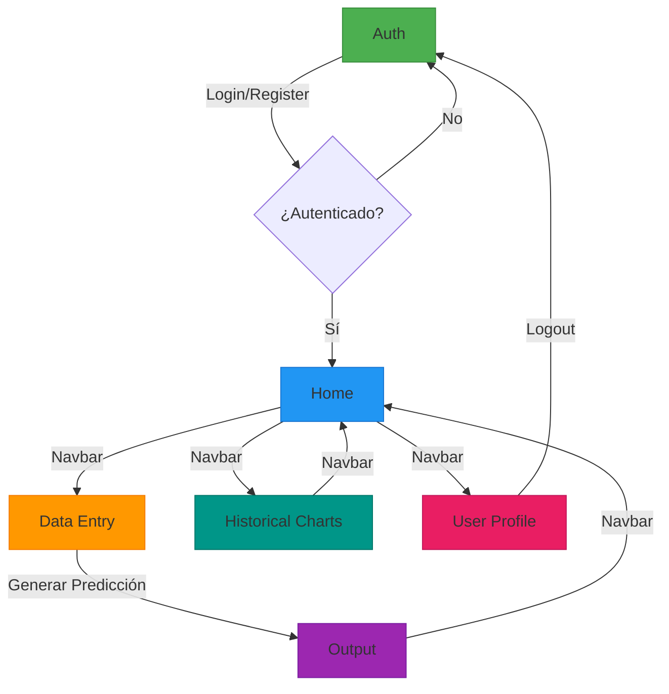
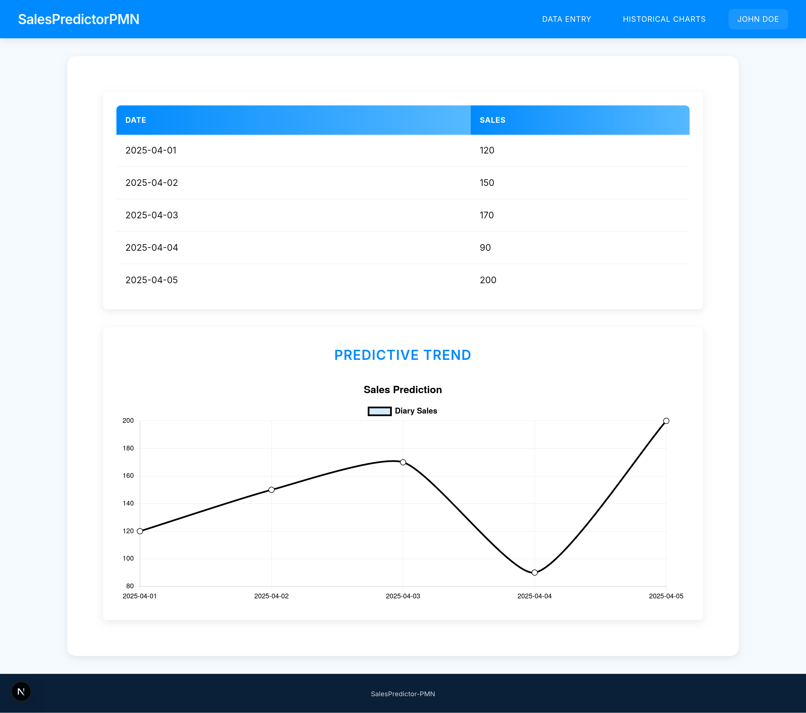
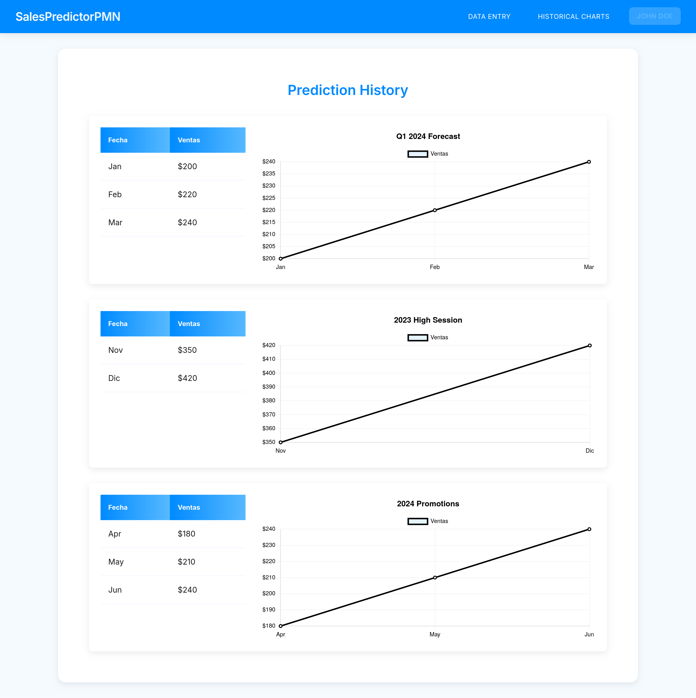
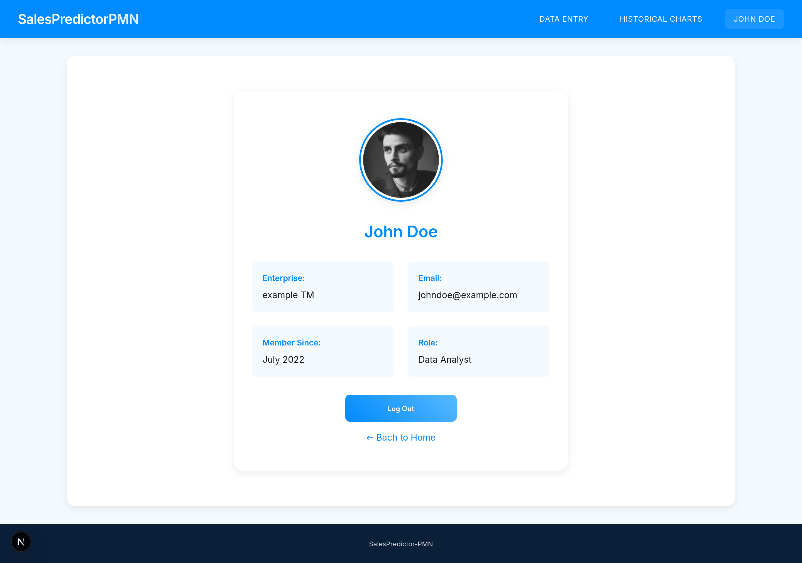

# SalesPredictor-PMN 🚀

**Predictor de Ventas - Maqueta Funcional (PMN)**
*Prototipo de demostración para análisis predictivo de ventas*


🔗 **[Ver despliegue en vivo aquí](https://sales-predictor-86tcd1ndb-sintaxis-projects.vercel.app/)**

---

## 📌 Descripción

SalesPredictor-PMN es una maqueta funcional (PMN) que simula un sistema completo de predicción de ventas, diseñado para demostrar capacidades técnicas y flujos de usuario. Es ideal para:

- Demostraciones técnicas de interfaces analíticas
- Pruebas de concepto de visualización de datos
- Proyectos educativos en desarrollo frontend
- Base para personalizaciones específicas

**Características clave:**
✅ Simulacion de autenticación de usuarios
✅ Simulacion de carga de datos predictivos (CSV/manual)
✅ Gráficos interactivos con análisis temporal
✅ Dashboard con histórico de predicciones

---

## 🏗️ Estructura del Proyecto

```bash
SalesPredictor-PMN/
├── components/
│   ├── Footer.tsx
│   ├── Form.tsx
│   ├── HistoricalChart.tsx
│   ├── Layout.tsx
│   ├── Loading.tsx
│   └── Nav.tsx
├── contexts/
│   └── AuthContext.tsx
├── pages/
│   ├── _app.tsx
│   ├── auth.tsx
│   ├── data-entry.tsx
│   ├── historical-charts.tsx
│   ├── index.tsx
│   ├── output.tsx
│   └── user.tsx
├── public/
│   └── assets/
│       ├── analytics.jpg
│       ├── growth.jpg
│       └── screenshots/
├── styles/
│   ├── Footer.module.css
│   ├── Form.module.css
│   ├── globals.css
│   ├── HistoricalCharts.module.css
│   ├── Home.module.css
│   ├── Layout.module.css
│   ├── Loading.module.css
│   ├── Nav.module.css
│   ├── Output.module.css
│   └── User.module.css
├── next.config.js
├── tsconfig.json
├── package.json
└── vercel.json
```

---

## 🗺️ Boceto de Navegación



**Leyenda del Diagrama:**
- 🟩 **Auth:** Pantalla de Login/Registro
- 🟦 **Home:** Página principal
- 🟧 **Data Entry:** Formulario de carga de datos
- 🟪 **Output:** Resultados de predicción
- 🟩 **Historical Charts:** Historial de análisis
- 🟥 **User Profile:** Perfil de usuario
---

## 🖼️ Capturas de Pantalla

|  |  |  |  |
|-----------------------------------------|--------------------------------------------|---------------------------------------------------------------|----------------------------------------|
| *Vista principal (Home)*                | *Resultados de predicción (Output)*        | *Análisis histórico (Historical Charts)*                      | *Perfil de usuario (User)*             |

---

## 🛠️ Instalación

### Requisitos:
- Node.js v18+
- Yarn
- Nix (opcional)

### Pasos:
```bash
# Con Nix (recomendado):
nix develop
yarn install

# Sin Nix:
yarn install
